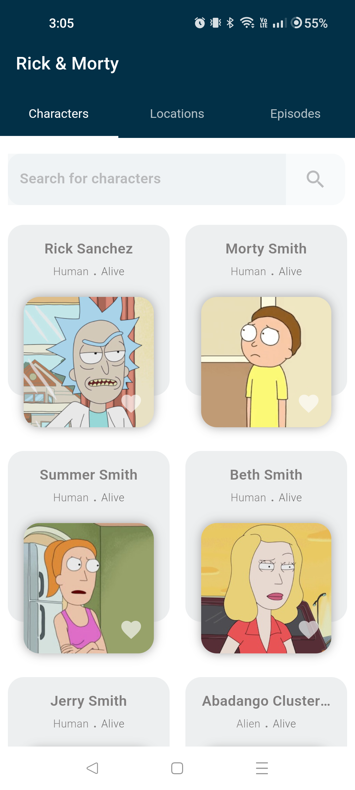
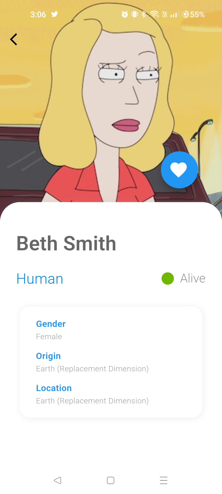
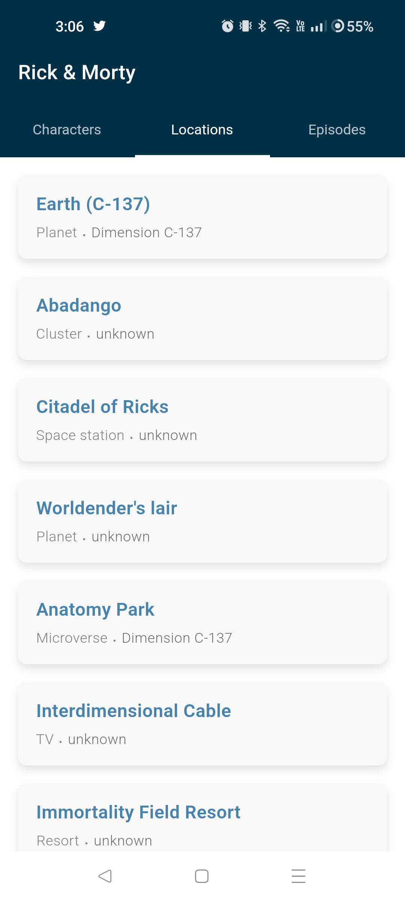

## Rick & Morty - Flutter

  <p align="left"> A Flutter clean-architecture project that uses BLoC and GraphQL.</p>

  <p align="left">
      <a href = "https://github.com/Solido/awesome-flutter">
        
      </a>
      <a href = "https://github.com/pushpalroy/rick_morty_flutter/stargazers">
        
      </a>
      <a href = "https://github.com/pushpalroy/rick_morty_flutter/network/members">
          
      </a>
      <a href = "https://github.com/pushpalroy/rick_morty_flutter/watchers">
          
      </a>
      <a href = "https://github.com/pushpalroy/rick_morty_flutter/issues">
          
      </a>
  </p>

### 👨‍💻 Tech stack

| Tools               |                              Link                               |
|:--------------------|:---------------------------------------------------------------:|
| 🤖 State Management |      [flutter_bloc](https://pub.dev/packages/flutter_bloc)      |
| 💚 Service Locator  |            [get_it](https://pub.dev/packages/get_it)            |
| 💉 DI               |        [injectable](https://pub.dev/packages/injectable)        |
| 🏛 Navigation       |         [go_router](https://pub.dev/packages/go_router)         |
| 🌊 GraphQL client   |   [graphql_flutter](https://pub.dev/packages/graphql_flutter)   |
| 🌐 Network State    | [connectivity_plus](https://pub.dev/packages/connectivity_plus) |

### ⚒️ Architecture

Rick & Morty Flutter follows the principles of Clean Architecture.
The project architecture has been inspired
from [Praxis Flutter](https://github.com/mutualmobile/PraxisFlutter).

### 🖥️ Screens

<table style="width:100%">
  <tr>
    <th>Characters</th>
    <th>Characters Info</th> 
    <th>Locations</th>
  </tr>
  <tr>
    <td></td> 
    <td></td>
    <td></td>
  </tr>
</table>

### Status: 👩‍💻 In progress

<p>Rick & Morty Flutter is under active development.</p>

### How to run tests? ✅

Integration tests

```
flutter drive \
--driver=test_driver/integration_test.dart \
--target=integration_test/app_test.dart \
--flavor=development
```

### Find this project useful ? ❤️

- Support it by clicking the ⭐️ button on the upper right of this page. ✌️

### License

```
MIT License

Copyright (c) 2022 Pushpal Roy

Permission is hereby granted, free of charge, to any person obtaining a 
copy of this software and associated documentation files (the "Software"), 
to deal in the Software without restriction, including without limitation 
the rights to use, copy, modify, merge, publish, distribute, sublicense, 
and/or sell copies of the Software, and to permit persons to whom the 
Software is furnished to do so, subject to the following conditions:

The above copyright notice and this permission notice shall be included 
in all copies or substantial portions of the Software.

THE SOFTWARE IS PROVIDED "AS IS", WITHOUT WARRANTY OF ANY KIND, EXPRESS OR 
IMPLIED, INCLUDING BUT NOT LIMITED TO THE WARRANTIES OF MERCHANTABILITY, 
FITNESS FOR A PARTICULAR PURPOSE AND NONINFRINGEMENT. IN NO EVENT SHALL THE 
AUTHORS OR COPYRIGHT HOLDERS BE LIABLE FOR ANY CLAIM, DAMAGES OR OTHER LIABILITY, 
WHETHER IN AN ACTION OF CONTRACT, TORT OR OTHERWISE, ARISING FROM, OUT OF OR IN 
CONNECTION WITH THE SOFTWARE OR THE USE OR OTHER DEALINGS IN THE SOFTWARE.
```
